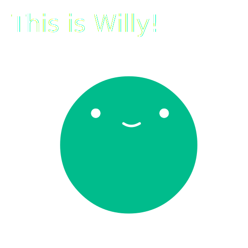

# Chapter 1: Introduction.

...to the wonderful **Nucleus Programming Language Book**!

**Willy** is a little guy that is going to be present in the illustrations of the book :D

## Why is the Book starting like this?

Well, its cool to have a pretty comfy introduction, so why not by introducing one of the greatest characters of all time!

**Isn't that right Willy?!**

**THAT'S THE SPIRIT! :D**

## So, what is the book about?

The book is going to guide and teach you how the Nucleus Programming Language works, from **zero**.

This means that we're going through all the process of teaching you how the **Command Prompt** or **Terminal** works, how you can code and make programs by using it, and of course, how to code with Nucleus!

**Willy** (and other characters later on) are going to be used to **illustrate complex situations and make them easier to understand**, and also for some **storytelling**! :D

## This *can* be a bit scary.

Since you're going into territory that most of the time is not *that* beginner-friendly, since you're probably used to **A LOT** of graphical interfaces. But don't worry! **This book will guide you from beginning to end, without any sort of issue**!

## What if i don't understand something in the Book at some point?

You **can always look it up** (via Google, Bing, etc.), or **ask online** (via StackOverflow, a programming forum, etc.).

**And you can always ask for help in our** [**Discord Server**](https://discord.com/invite/35RTEFbWxS).

**Don't be afraid if you think the question is "dumb" to ask**, because there's no such thing as a stupid or dumb question. Always ask for help no matter what :)

**These situations where you don't know what to do, will be tackled later on in more depth, and it'll give you helpful tips when you're stuck in a situation :D**

## Are you ready?

If that's the case, then let's start with our first "Sub-Chapter":

[Chapter 1.1](Book/Chapter1/1.md)

See you there! :D