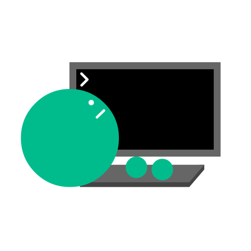
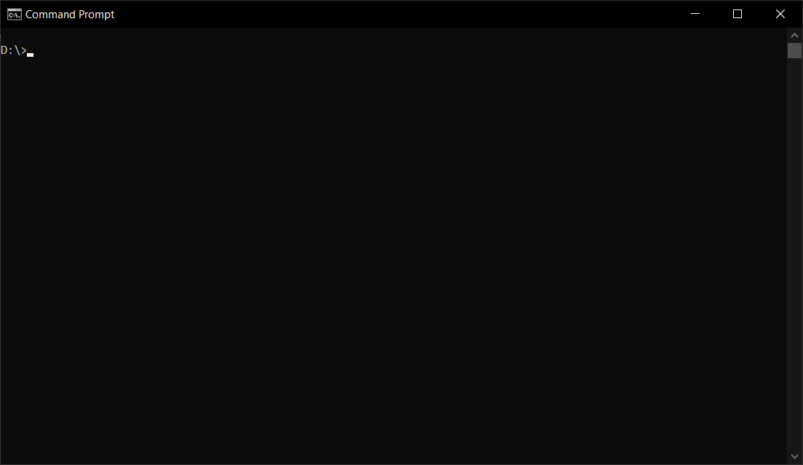
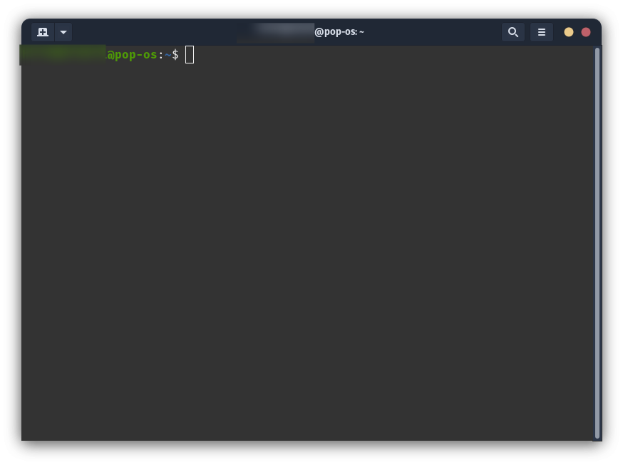
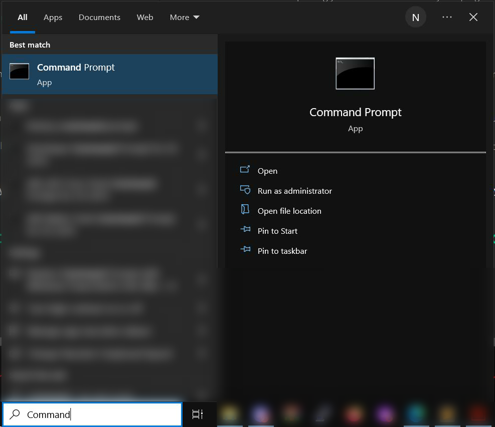
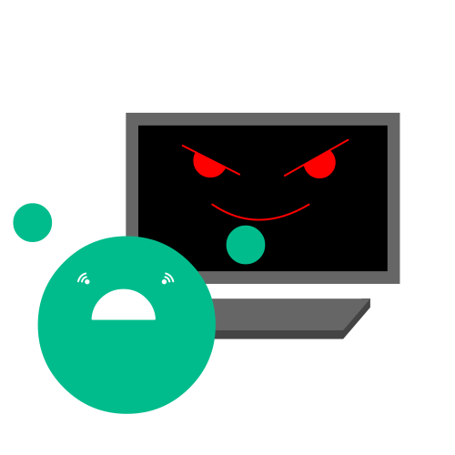

# Chapter 1.1: The Terminal.

Welcome to Chapter 1.1! In this sub-chapter, we're going to introduce something that *can* be a bit scary, but it'll end up being your best friend in not only *this* programming language, **but in programming in general**: **The Terminal**.

## What is the Terminal?

The Terminal (also known as "The Command Prompt" in some Operating Systems), is a program where you type commands that your computer is going to follow.

**Visual Examples:**

***Screenshot of The Windows Terminal:***

***Screenshot of a Linux Terminal (PopOS):***

That is what it does, and its in any device that you can find: computers, cellphones and even videogame consoles!

Depending of your device, the Terminal can be either really hidden and hard to access, or really easy by just looking it up in a Search Bar.

Since we're on a computer, **on most Operating Systems (*Windows, MacOS, Linux, etc.*) its pretty easy to find**.

***Example: on Windows 10, you can find the Terminal pretty easily by just typing "Command Prompt" on the Search Bar:***

## What's the use of the Terminal?

In programming, the Terminal is used a lot for tools.

And we're gonna use those tools to access the commands and programs that will allow you to **create our own programs**.

**The Command Prompt is the one that holds everything together in the world of programming** and Nucleus is not an exception.

## Is it used *only* for programming?

Not at all, for example, its used to:

- **Set up Servers.**
	
	If you ever tried to set up a Minecraft Server to play with your friends, you'll probably came across with this.

- **Configure, Customize or Fix Operating Systems.**

	On Windows for example, if your PC starts to get critical errors from time to time, you use the Terminal to fix those issues.

- **and more...**

## The Terminal *can* be a bit scary.

Since we have this incredible amount of power with something that is *only* text and doesn't have too many visual elements, it makes sense that you're scared of typing a command or making a mistake that results in your computer having critical errors.

But you don't have to worry about it, because:

1. **There are systems that protect you from making big mistakes**, so its *really hard* to accidentally delete your operating system when you barely know how to do it.

2. **If you manage to make a mistake by accident, it can be repaired**, even as something as small as changing some settings by accident can be changed back, so don't panic if that happens.

3. **If a program fails, there's always going to be another program that manages the error**. If there's an error, there's always going to be something in the Operating System (or in some cases, the program that failed can have mechanisms against errors) that'll tell you what happen without *everything falling apart*.

## "With great power, comes great responsibility."

Even with all of these points showed above, you *still* have the power of intentionally breaking stuff apart.

If you don't want any trouble in your system, make sure that what you're doing *is not something extremely dangerous*.

**Always inform yourself and look it up on the Internet** if needed, to see what command does what.

Of course, this book will teach you commands that on its own are safe and nothing bad will happen, but if you ever came across with a situation where you have to modify incredibly *sensitive* stuff (specially as a programmer), always make sure that what you're doing is 100% correct.

## Great!

Now you know what the Terminal is, a useful tool that if you use it right, is going to be your best friend :D

In the Next Sub-Chatper, we're going to put to use it and do cool stuff with it!

[Chapter 1.2](Book/Chapter1/2.md)

See you there! :)