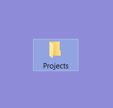
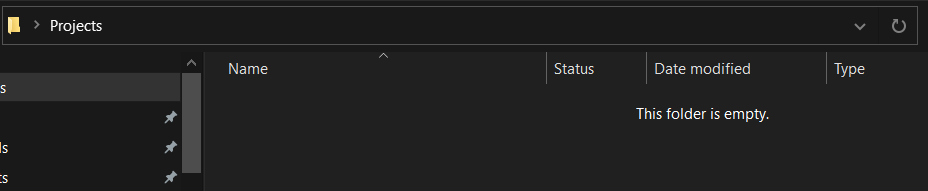
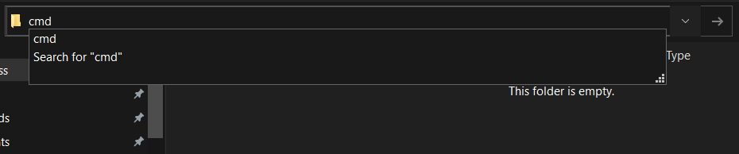
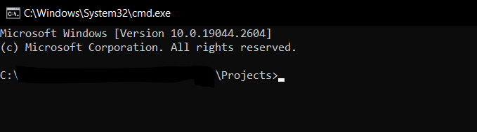
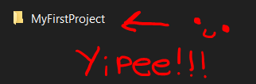

# Chapter 1.3: The First Project.

Welcome to this exciting new Chapter 1.3!

In this section, we're going to use our knowledge from the Terminal, and use it to create our first project!

This will be really easy, since we already know how to get access to the Nucleus Tools.

Let's get started!

## The Current Setup.

We're going to plan a little setup for the project which consists on a single folder.

On this case, its going to be a folder called "Projects" located in the Desktop.

***Example on Windows:***



You can put this folder anywhere you want, if its not in the Desktop, it could've in Documents or in other folders for example.

Or if you don't have a Desktop, you can just put it in the current folder that you're in the Terminal.

The choice is yours!

## Accessing the Terminal from the Folder.

Once we access the folder, we can open the Terminal from there:

Here's a little index of different options of how to open the Terminal in different operating systems:

- [With the Windows GUI](./#With-the-Windows-GUI)
- [With most Linux GUIs](./#With-most-Linux-GUIs)

### With the Windows GUI

From the File Explorer, you can do this neat little trick:

Click the box that shows the path you're currently in, in this case, the path to the Projects folder:



And once you click that, its going to select a big chunk of text, that text is the current full path in its text form.

Replace that text entirely with "cmd".



And once you hit Enter, it'll open up the Terminal in the Projects folder!



### With most Linux GUIs

*(TODO)*

## The "Create" Command

Now, inside the current folder we're in, we can now use:

`nucleus create <name-of-your-project>`

Let's break down to see what is this command doing:

- `nucleus` calls the Nucleus Compiler.
- `create` tells the Compiler to Create a Project.

	- The project is mostly a folder with contents inside, which we're going to talk about later.

- `<name-of-your-project>` is the name of your project, in this case, i'm going to call it "MyFirstProject", but you can call it anyway you want, here are some name ideas:

	- FirstProject
	- Test
	- SomeProj
	- ILikeApples

Once we type this command and press Enter, we can see these messages popping up in our Terminal:

```
>nucleus create MyFirstProject
Creating "MyFirstProject"...
Project "MyFirstProject" successfully created!
```

Now, a folder called "MyFirstProject" should appear in your "Projects" folder!



But if it doesn't, here are some fixes.

## Common Issues with `nucleus create`

### "Sorry, but this folder already exists..."

```
>nucleus create MyFirstProject
Error: Sorry, but the folder 'MyFirstProject' already exists...
```

This error can happen because the folder with the name you provided already exists inside the current directory.

The solutions to this can be:

- **Delete 'MyFirstProject' from the folder**
- **Put a different name to the project**
- **Go to a different folder**

### "The name of the project can't have special characters..."

```
>nucleus create The@%4Project
Error: Sorry, but the name of the project can't have special characters, only letters and numbers are allowed!
```

In this example, the issue with calling it "The@%4Project" is that @ and % appear. Since only letters and numbers can only be used, removing these should fix the issue.

### It says that its successfully created, but i can't find the folder.

This is a pretty common mistake with beginners using the Terminal, so don't worry if this happens to you :D

Before reporting anything, make sure:

- **That you're in the correct folder**: Sometimes it can happen that you think you're in the Projects folder, but in reality you're in another folder. To make sure, take a look at the current path that the Terminal is and check if the Terminal is in the correct directory.

- **That you have the correct permissions to do so:** This is a weird scenario, but it can happen that your current user, session or even the program itself doesn't have permissions to Write a folder or filename, one of the common reasons why is due to Parental Controls or you can't do stuff on *that* specific folder.

	One of the solutions can be:
	
	- **If you have Parental Controls enabled, Make sure that it allows you to write folders and filenames.**
	- **Go to a different folder.**
	- **Make sure that your current user has the permissions correctly set.**

If none of these solutions work, feel free to report it!

If you don't know how, here's a section that explains how can you report a bug:

*(TODO: Make "How to Report a Bug" section.)*

## Congratulations!

You successfully completed the Chapter 1.3 of the Nucleus Book!

Upnext, we're going to get more technical now that you created projects with it! See you there! :)

*(TODO: Make Chapter 1.4)*